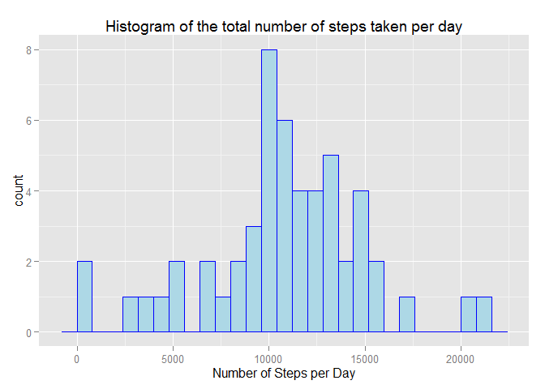
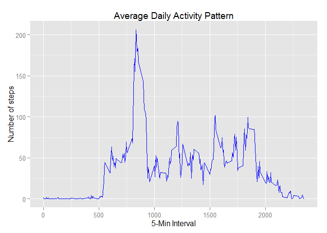
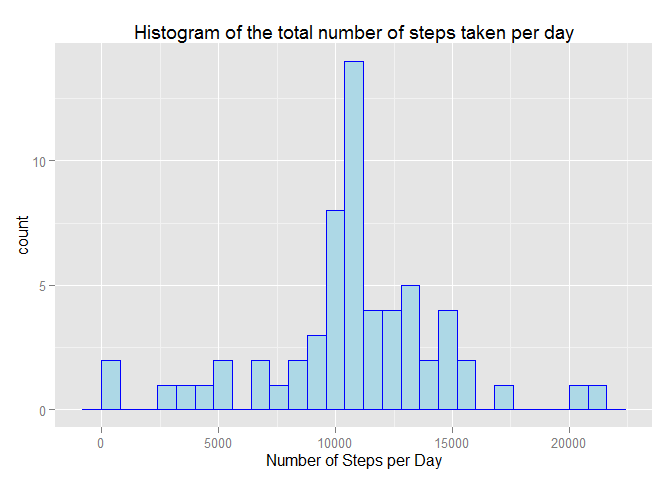
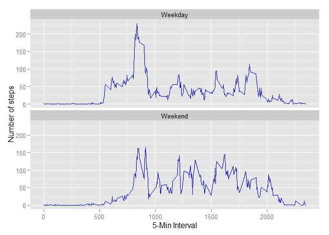

# Reproducible Research: Peer Assessment 1


## Loading and preprocessing the data

0. Load all required libraries for the report


```r
library(knitr)
library(dplyr)
library(ggplot2)
```

1. Load data from activity.csv file. This file saved to the working directory.


```r
activity <- read.csv(file = "g://_Coursera//Reproducible Research//activity.csv", sep = ",", header = TRUE,
                        colClasses=c("numeric", "Date", "numeric"))
```


## What is mean total number of steps taken per day?

1. Making a histogram of the total number of steps taken each day


```r
activity.aggrDate <- activity %>% filter(steps >= 0) %>% group_by(date) %>%
        summarise(steps.total = sum(steps))

ggplot(activity.aggrDate, aes(x = steps.total)) + geom_histogram(color = "blue", fill = "lightblue", binwidth = 800) + 
        labs(title="Histogram of the total number of steps taken per day",
               x = "Number of Steps per Day")
```

 

2. Calculating median and mean


```r
steps.mean   <- as.character(round(mean(activity.aggrDate$steps.total), digits = 2))
steps.median <- as.character(median(activity.aggrDate$steps.total))
```

The mean total number of steps taken per day would be equal **10766.19**

and the median **10765**.


## What is the average daily activity pattern?

1. Making a time series plot of the 5-minute interval (x-axis)
and the average number of steps taken, averaged across all days (y-axis)


```r
activity.aggrInterval <- activity %>% filter(steps >= 0) %>% group_by(interval) %>%
        summarise(steps.mean = mean(steps))

ggplot(activity.aggrInterval, aes(x=interval, y=steps.mean)) +   
        geom_line(color="blue") +  
        labs(title="Average Daily Activity Pattern",
                x="5-Min Interval",
                y="Number of steps")
```

 

```r
interval.MaxSteps <- filter(activity.aggrInterval, steps.mean == max(steps.mean))
```

2. The maximum number of average **206.17** steps contains in **835-th** interval

## Imputing missing values

1. Calculating the total number of missing values in the source dataset


```r
missing.values <- sum(is.na(activity$steps))
```

The are **2304** total number of rows with NA.

2. The strategy for filling all the missing values would be using mean rounded to the integer for the same intervals.

3. Creating a new dataset with the missing data filled in.


```r
coalesce <- function(...) {
        apply(cbind(...), 1, function(x) x[which(!is.na(x))[1]])
}

activity.noNA <- inner_join(activity, activity.aggrInterval, by = "interval")
activity.noNA <- mutate(activity.noNA, steps = coalesce(steps, round(steps.mean, 0)))


missing.values <- sum(is.na(activity$steps))
```

4. Making histogram of the total number of steps taken each day and Calculating
the mean and median total number of steps taken per day.


```r
activity.noNA.aggrDate <- activity.noNA %>% filter(steps >= 0) %>% group_by(date) %>%
        summarise(steps.total = sum(steps))
ggplot(activity.noNA.aggrDate, aes(x = steps.total)) + geom_histogram(color = "blue", fill = "lightblue", binwidth = 800) + 
        labs(title="Histogram of the total number of steps taken per day",
               x = "Number of Steps per Day")
```

 


```r
steps.mean   <- as.character(round(mean(activity.noNA.aggrDate$steps.total), digits = 2))
steps.median <- as.character(median(activity.noNA.aggrDate$steps.total))
```

The mean total number of steps taken per day would be equal **10765.64**

and the median **10762**.

In comparrison with the estimates from the first part mean is almost equal but median is lower.

## Are there differences in activity patterns between weekdays and weekends?

1. Creating a new factor variable in the dataset with two levels - "weekday"
and "weekend" indicating whether a given date is a weekday or weekend day.


```r
activity.byWeek <- mutate(activity.noNA, 
        week = ifelse(weekdays(date) %in% c("Saturday", "Sunday"),"Weekend","Weekday"))
```

2. Making a panel plot containing a time series plot of the 5-minute interval (x-axis)
and the average number of steps taken, averaged across all weekday days or
weekend days (y-axis).


```r
activity.byWeek.aggr <- activity.byWeek %>% filter(steps >= 0) %>% group_by(week, interval) %>%
        summarise(steps.mean = mean(steps))
ggplot(activity.byWeek.aggr, aes(x=interval, y=steps.mean)) + 
        geom_line(color="blue") + 
        facet_wrap(~ week, nrow=2, ncol=1) +
        labs(x="5-Min Interval",
             y="Number of steps")
```

 

The patterns for weekdays and weekends are different, what is meant that respondents have different
activities patterns over Weekends in comparison with Weekdays. On Weekdays - very active
in the mornings then in the evenings and low activity level between it. On Weekends - gets up
later in the mornings and have almost the same activity level during the day.


